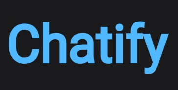
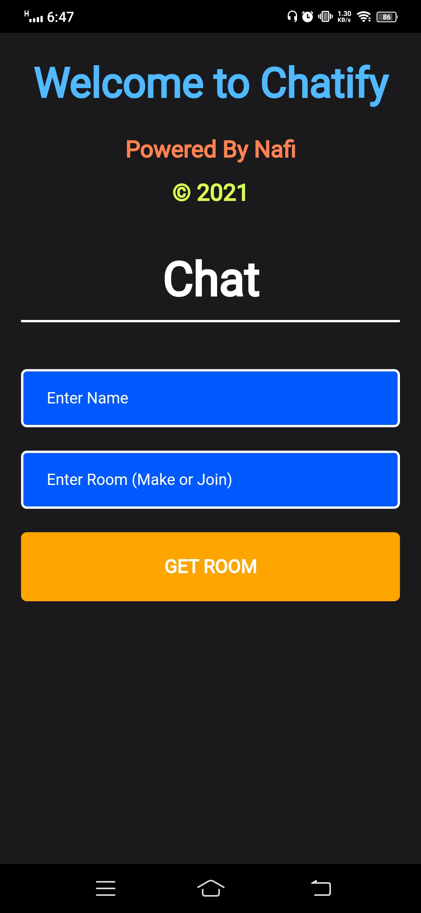

# Chatify

## Site-Link
chatify-nafi.netlify.app


## Author 
[Nafi Mahmud][author]

[author]: https://sourcecodebd.github.io/nafi.com/
A chatting application made with React as client-side, Express, Node as server-side. Feel free to check live site as well as source code.


# Chatify - Android App 



Unlike other services, Chatify is free and open source.  
Chatify for Android is a companion app of [nafi.com]: (https://sourcecodebd.github.io/nafi.com/). You need a Chatify account or room first, which you are going to use in this app.

Chatify is available on the Google Play Store and APKPure.

<p align="left">
<a href="https://apkpure.com/u/6807460/post/13067377">
    
</a>  
</p>

## About

Chatify makes life better! 4 vital reasons why chatify is better than messenger
- user can access thru room code instead of password authentication. 
- no risk of losing/hijacking  data
-user can communicate with others thru socket.io realtime broadcast connection.
- 10 times more lightweight than messenger

## Features

The android app lets you:
- Completely ad-free.
- Needs no special permissions on Android 6.0+.

## Screenshots

[](Images/front-page.jpg)
[](Images/message-box.jpeg)

## Permissions

On Android versions prior to Android 6.0, Chatify requires the following permissions:
- Full Network Access.
- View Network Connections.
- Run at startup.
- Read and write access to external storage.

The "Run at startup" permission is only used if Auto-Sync feature is enabled and is not utilised otherwise. The network access permissions are made use of for downloading content. The external storage permission is used to cache article images for viewing offline.

## Contributing

Chatify app is a free and open source project developed by volunteers. Any contributions are welcome. Here are a few ways you can help:
 * [Report bugs and make suggestions.](https://github.com/sourcecodebd/Chatify/issues)


# [React](https://reactjs.org/) &middot; [](https://github.com/facebook/react/blob/master/LICENSE) [](https://www.npmjs.com/package/react) [](https://circleci.com/gh/facebook/react) [](https://reactjs.org/docs/how-to-contribute.html#your-first-pull-request)

React is a JavaScript library for building user interfaces.

* **Declarative:** React makes it painless to create interactive UIs. Design simple views for each state in your application, and React will efficiently update and render just the right components when your data changes. Declarative views make your code more predictable, simpler to understand, and easier to debug.
* **Component-Based:** Build encapsulated components that manage their own state, then compose them to make complex UIs. Since component logic is written in JavaScript instead of templates, you can easily pass rich data through your app and keep state out of the DOM.
* **Learn Once, Write Anywhere:** We don't make assumptions about the rest of your technology stack, so you can develop new features in React without rewriting existing code. React can also render on the server using Node and power mobile apps using [React Native](https://reactnative.dev/).

[Learn how to use React in your own project](https://reactjs.org/docs/getting-started.html).

## Installation

React has been designed for gradual adoption from the start, and **you can use as little or as much React as you need**:

* Use [Online Playgrounds](https://reactjs.org/docs/getting-started.html#online-playgrounds) to get a taste of React.
* [Add React to a Website](https://reactjs.org/docs/add-react-to-a-website.html) as a `<script>` tag in one minute.
* [Create a New React App](https://reactjs.org/docs/create-a-new-react-app.html) if you're looking for a powerful JavaScript toolchain.

You can use React as a `<script>` tag from a [CDN](https://reactjs.org/docs/cdn-links.html), or as a `react` package on [npm](https://www.npmjs.com/package/react).

## Documentation

You can find the React documentation [on the website](https://reactjs.org/docs).  

Check out the [Getting Started](https://reactjs.org/docs/getting-started.html) page for a quick overview.

The documentation is divided into several sections:

* [Tutorial](https://reactjs.org/tutorial/tutorial.html)
* [Main Concepts](https://reactjs.org/docs/hello-world.html)
* [Advanced Guides](https://reactjs.org/docs/jsx-in-depth.html)
* [API Reference](https://reactjs.org/docs/react-api.html)
* [Where to Get Support](https://reactjs.org/community/support.html)
* [Contributing Guide](https://reactjs.org/docs/how-to-contribute.html)

You can improve it by sending pull requests to [this repository](https://github.com/reactjs/reactjs.org).

## Examples

We have several examples [on the website](https://reactjs.org/). Here is the first one to get you started:

```jsx
function HelloMessage({ name }) {
  return <div>Hello {name}</div>;
}

ReactDOM.render(
  <HelloMessage name="Nafi" />,
  document.getElementById('container')
);
```

This example will render "Hello Taylor" into a container on the page.

You'll notice that we used an HTML-like syntax; [we call it JSX](https://reactjs.org/docs/introducing-jsx.html). JSX is not required to use React, but it makes code more readable, and writing it feels like writing HTML. If you're using React as a `<script>` tag, read [this section](https://reactjs.org/docs/add-react-to-a-website.html#optional-try-react-with-jsx) on integrating JSX; otherwise, the [recommended JavaScript toolchains](https://reactjs.org/docs/create-a-new-react-app.html) handle it automatically.

## Contributing

The main purpose of this repository is to continue evolving React core, making it faster and easier to use. Development of React happens in the open on GitHub, and we are grateful to the community for contributing bugfixes and improvements. Read below to learn how you can take part in improving React.

### [Code of Conduct](https://code.fb.com/codeofconduct)

Facebook has adopted a Code of Conduct that we expect project participants to adhere to. Please read [the full text](https://code.fb.com/codeofconduct) so that you can understand what actions will and will not be tolerated.

### [Contributing Guide](https://reactjs.org/contributing/how-to-contribute.html)

Read our [contributing guide](https://reactjs.org/contributing/how-to-contribute.html) to learn about our development process, how to propose bugfixes and improvements, and how to build and test your changes to React.

### Good First Issues

To help you get your feet wet and get you familiar with our contribution process, we have a list of [good first issues](https://github.com/facebook/react/labels/good%20first%20issue) that contain bugs which have a relatively limited scope. This is a great place to get started.

### License

React is  [MIT licensed](./LICENSE).


<!--lint disable no-literal-urls-->
<p align="center">
  <a href="https://nodejs.org/">
    
  </a>
</p>

Node.js is an open-source, cross-platform, JavaScript runtime environment. It
executes JavaScript code outside of a browser. For more information on using
Node.js, see the [Node.js Website][].

The Node.js project uses an [open governance model](./GOVERNANCE.md). The
[OpenJS Foundation][] provides support for the project.

**This project is bound by a [Code of Conduct][].**

# Table of contents

* [Support](#support)
* [Release types](#release-types)
  * [Download](#download)
    * [Current and LTS releases](#current-and-lts-releases)
    * [Nightly releases](#nightly-releases)
    * [API documentation](#api-documentation)
  * [Verifying binaries](#verifying-binaries)
* [Building Node.js](#building-nodejs)
* [Security](#security)
* [Contributing to Node.js](#contributing-to-nodejs)
* [Current project team members](#current-project-team-members)
  * [TSC (Technical Steering Committee)](#tsc-technical-steering-committee)
  * [Collaborators](#collaborators)
  * [Release keys](#release-keys)
* [License](#license)

## Support

Looking for help? Check out the
[instructions for getting support](.github/SUPPORT.md).

## Release types

* **Current**: Under active development. Code for the Current release is in the
  branch for its major version number (for example,
  [v15.x](https://github.com/nodejs/node/tree/v15.x)). Node.js releases a new
  major version every 6 months, allowing for breaking changes. This happens in
  April and October every year. Releases appearing each October have a support
  life of 8 months. Releases appearing each April convert to LTS (see below)
  each October.
* **LTS**: Releases that receive Long-term Support, with a focus on stability
  and security. Every even-numbered major version will become an LTS release.
  LTS releases receive 12 months of _Active LTS_ support and a further 18 months
  of _Maintenance_. LTS release lines have alphabetically-ordered code names,
  beginning with v4 Argon. There are no breaking changes or feature additions,
  except in some special circumstances.
* **Nightly**: Code from the Current branch built every 24-hours when there are
  changes. Use with caution.

Current and LTS releases follow [Semantic Versioning](https://semver.org). A
member of the Release Team [signs](#release-keys) each Current and LTS release.
For more information, see the
[Release README](https://github.com/nodejs/Release#readme).

### Download

Binaries, installers, and source tarballs are available at
<https://nodejs.org/en/download/>.

#### Current and LTS releases
<https://nodejs.org/download/release/>

The [latest](https://nodejs.org/download/release/latest/) directory is an
alias for the latest Current release. The latest-_codename_ directory is an
alias for the latest release from an LTS line. For example, the
[latest-fermium](https://nodejs.org/download/release/latest-fermium/) directory
contains the latest Fermium (Node.js 14) release.

#### Nightly releases
<https://nodejs.org/download/nightly/>

Each directory name and filename contains a date (in UTC) and the commit
SHA at the HEAD of the release.

#### API documentation

Documentation for the latest Current release is at <https://nodejs.org/api/>.
Version-specific documentation is available in each release directory in the
_docs_ subdirectory. Version-specific documentation is also at
<https://nodejs.org/download/docs/>.

### Verifying binaries

Download directories contain a `SHASUMS256.txt` file with SHA checksums for the
files.

To download `SHASUMS256.txt` using `curl`:

```console
$ curl -O https://nodejs.org/dist/vx.y.z/SHASUMS256.txt
```

To check that a downloaded file matches the checksum, run
it through `sha256sum` with a command such as:

```console
$ grep node-vx.y.z.tar.gz SHASUMS256.txt | sha256sum -c -
```

For Current and LTS, the GPG detached signature of `SHASUMS256.txt` is in
`SHASUMS256.txt.sig`. You can use it with `gpg` to verify the integrity of
`SHASUMS256.txt`. You will first need to import
[the GPG keys of individuals authorized to create releases](#release-keys). To
import the keys:

```console
$ gpg --keyserver pool.sks-keyservers.net --recv-keys DD8F2338BAE7501E3DD5AC78C273792F7D83545D
```

See the bottom of this README for a full script to import active release keys.

Next, download the `SHASUMS256.txt.sig` for the release:

```console
$ curl -O https://nodejs.org/dist/vx.y.z/SHASUMS256.txt.sig
```

Then use `gpg --verify SHASUMS256.txt.sig SHASUMS256.txt` to verify
the file's signature.

## Building Node.js

See [BUILDING.md](BUILDING.md) for instructions on how to build Node.js from
source and a list of supported platforms.

## Security

For information on reporting security vulnerabilities in Node.js, see
[SECURITY.md](./SECURITY.md).

## Contributing to Node.js

* [Contributing to the project][]
* [Working Groups][]
* [Strategic Initiatives][]
* [Technical values and prioritization][]

## Current project team members

For information about the governance of the Node.js project, see
[GOVERNANCE.md](./GOVERNANCE.md).

## License

Node.js is available under the
[MIT license](https://opensource.org/licenses/MIT). Node.js also includes
external libraries that are available under a variety of licenses.  See
[LICENSE](https://github.com/nodejs/node/blob/master/LICENSE) for the full
license text.

[Code of Conduct]: https://github.com/nodejs/admin/blob/master/CODE_OF_CONDUCT.md
[Contributing to the project]: CONTRIBUTING.md
[Node.js Website]: https://nodejs.org/
[OpenJS Foundation]: https://openjsf.org/
[Strategic Initiatives]: https://github.com/nodejs/TSC/blob/master/Strategic-Initiatives.md
[Technical values and prioritization]: doc/guides/technical-values.md
[Working Groups]: https://github.com/nodejs/TSC/blob/master/WORKING_GROUPS.md


# socket.io
[](https://repl.it/github/socketio/socket.io)
[](#backers) [](#sponsors)
[](https://github.com/socketio/socket.io/actions)
[](https://david-dm.org/socketio/socket.io)
[](https://david-dm.org/socketio/socket.io#info=devDependencies)
[](https://www.npmjs.com/package/socket.io)

[](https://slackin-socketio.now.sh)

## Features

Socket.IO enables real-time bidirectional event-based communication. It consists of:

- a Node.js server (this repository)
- a [Javascript client library](https://github.com/socketio/socket.io-client) for the browser (or a Node.js client)

Some implementations in other languages are also available:

- [Java](https://github.com/socketio/socket.io-client-java)
- [C++](https://github.com/socketio/socket.io-client-cpp)
- [Swift](https://github.com/socketio/socket.io-client-swift)
- [Dart](https://github.com/rikulo/socket.io-client-dart)
- [Python](https://github.com/miguelgrinberg/python-socketio)
- [.Net](https://github.com/Quobject/SocketIoClientDotNet)

Its main features are:

#### Reliability

Connections are established even in the presence of:
  - proxies and load balancers.
  - personal firewall and antivirus software.

For this purpose, it relies on [Engine.IO](https://github.com/socketio/engine.io), which first establishes a long-polling connection, then tries to upgrade to better transports that are "tested" on the side, like WebSocket. Please see the [Goals](https://github.com/socketio/engine.io#goals) section for more information.

#### Auto-reconnection support

Unless instructed otherwise a disconnected client will try to reconnect forever, until the server is available again. Please see the available reconnection options [here](https://socket.io/docs/v3/client-api/#new-Manager-url-options).

#### Disconnection detection

A heartbeat mechanism is implemented at the Engine.IO level, allowing both the server and the client to know when the other one is not responding anymore.

That functionality is achieved with timers set on both the server and the client, with timeout values (the `pingInterval` and `pingTimeout` parameters) shared during the connection handshake. Those timers require any subsequent client calls to be directed to the same server, hence the `sticky-session` requirement when using multiples nodes.

#### Binary support

Any serializable data structures can be emitted, including:

- [ArrayBuffer](https://developer.mozilla.org/en-US/docs/Web/JavaScript/Reference/Global_Objects/ArrayBuffer) and [Blob](https://developer.mozilla.org/en-US/docs/Web/API/Blob) in the browser
- [ArrayBuffer](https://developer.mozilla.org/en-US/docs/Web/JavaScript/Reference/Global_Objects/ArrayBuffer) and [Buffer](https://nodejs.org/api/buffer.html) in Node.js

#### Simple and convenient API

Sample code:

```js
io.on('connection', socket => {
  socket.emit('request', /* … */); // emit an event to the socket
  io.emit('broadcast', /* … */); // emit an event to all connected sockets
  socket.on('reply', () => { /* … */ }); // listen to the event
});
```

#### Cross-browser

Browser support is tested in Sauce Labs:

[](https://saucelabs.com/u/socket)

#### Multiplexing support

In order to create separation of concerns within your application (for example per module, or based on permissions), Socket.IO allows you to create several `Namespaces`, which will act as separate communication channels but will share the same underlying connection.

#### Room support

Within each `Namespace`, you can define arbitrary channels, called `Rooms`, that sockets can join and leave. You can then broadcast to any given room, reaching every socket that has joined it.

This is a useful feature to send notifications to a group of users, or to a given user connected on several devices for example.


**Note:** Socket.IO is not a WebSocket implementation. Although Socket.IO indeed uses WebSocket as a transport when possible, it adds some metadata to each packet: the packet type, the namespace and the ack id when a message acknowledgement is needed. That is why a WebSocket client will not be able to successfully connect to a Socket.IO server, and a Socket.IO client will not be able to connect to a WebSocket server (like `ws://echo.websocket.org`) either. Please see the protocol specification [here](https://github.com/socketio/socket.io-protocol).

## Installation

```bash
// with npm
npm install socket.io

// with yarn
yarn add socket.io
```

## How to use

The following example attaches socket.io to a plain Node.JS
HTTP server listening on port `3000`.

```js
const server = require('http').createServer();
const io = require('socket.io')(server);
io.on('connection', client => {
  client.on('event', data => { /* … */ });
  client.on('disconnect', () => { /* … */ });
});
server.listen(3000);
```

### Standalone

```js
const io = require('socket.io')();
io.on('connection', client => { ... });
io.listen(3000);
```

### In conjunction with Express

Starting with **3.0**, express applications have become request handler
functions that you pass to `http` or `http` `Server` instances. You need
to pass the `Server` to `socket.io`, and not the express application
function. Also make sure to call `.listen` on the `server`, not the `app`.

```js
const app = require('express')();
const server = require('http').createServer(app);
const io = require('socket.io')(server);
io.on('connection', () => { /* … */ });
server.listen(3000);
```

### In conjunction with Koa

Like Express.JS, Koa works by exposing an application as a request
handler function, but only by calling the `callback` method.

```js
const app = require('koa')();
const server = require('http').createServer(app.callback());
const io = require('socket.io')(server);
io.on('connection', () => { /* … */ });
server.listen(3000);
```

### In conjunction with Fastify

To integrate Socket.io in your Fastify application you just need to
register `chatify-socket.io` plugin. It will create a `decorator`
called `io`.

```js
const app = require('chatify')();
app.register(require('chatify-socket.io'));
app.io.on('connection', () => { /* … */ });
app.listen(3000);
```

## Documentation

Please see the documentation [here](https://socket.io/docs/).

The source code of the website can be found [here](https://github.com/socketio/socket.io-website). Contributions are welcome!

## Debug / logging

Socket.IO is powered by [debug](https://github.com/visionmedia/debug).
In order to see all the debug output, run your app with the environment variable
`DEBUG` including the desired scope.

To see the output from all of Socket.IO's debugging scopes you can use:

```
DEBUG=socket.io* node myapp
```

## Testing

```
npm test
```
This runs the `gulp` task `test`. By default the test will be run with the source code in `lib` directory.

Set the environmental variable `TEST_VERSION` to `compat` to test the transpiled es5-compat version of the code.

The `gulp` task `test` will always transpile the source code into es5 and export to `dist` first before running the test.


## Backers

Support us with a monthly donation and help us continue our activities. [[Become a backer](https://opencollective.com/socketio#backer)]

<a href="https://opencollective.com/socketio/backer/0/website" target="_blank"></a>
<a href="https://opencollective.com/socketio/backer/1/website" target="_blank"></a>
<a href="https://opencollective.com/socketio/backer/2/website" target="_blank"></a>
<a href="https://opencollective.com/socketio/backer/3/website" target="_blank"></a>
<a href="https://opencollective.com/socketio/backer/4/website" target="_blank"></a>
<a href="https://opencollective.com/socketio/backer/5/website" target="_blank"></a>
<a href="https://opencollective.com/socketio/backer/6/website" target="_blank"></a>
<a href="https://opencollective.com/socketio/backer/7/website" target="_blank"></a>
<a href="https://opencollective.com/socketio/backer/8/website" target="_blank"></a>
<a href="https://opencollective.com/socketio/backer/9/website" target="_blank"></a>
<a href="https://opencollective.com/socketio/backer/10/website" target="_blank"></a>
<a href="https://opencollective.com/socketio/backer/11/website" target="_blank"></a>
<a href="https://opencollective.com/socketio/backer/12/website" target="_blank"></a>
<a href="https://opencollective.com/socketio/backer/13/website" target="_blank"></a>
<a href="https://opencollective.com/socketio/backer/14/website" target="_blank"></a>
<a href="https://opencollective.com/socketio/backer/15/website" target="_blank"></a>
<a href="https://opencollective.com/socketio/backer/16/website" target="_blank"></a>
<a href="https://opencollective.com/socketio/backer/17/website" target="_blank"></a>
<a href="https://opencollective.com/socketio/backer/18/website" target="_blank"></a>
<a href="https://opencollective.com/socketio/backer/19/website" target="_blank"></a>
<a href="https://opencollective.com/socketio/backer/20/website" target="_blank"></a>
<a href="https://opencollective.com/socketio/backer/21/website" target="_blank"></a>
<a href="https://opencollective.com/socketio/backer/22/website" target="_blank"></a>
<a href="https://opencollective.com/socketio/backer/23/website" target="_blank"></a>
<a href="https://opencollective.com/socketio/backer/24/website" target="_blank"></a>
<a href="https://opencollective.com/socketio/backer/25/website" target="_blank"></a>
<a href="https://opencollective.com/socketio/backer/26/website" target="_blank"></a>
<a href="https://opencollective.com/socketio/backer/27/website" target="_blank"></a>
<a href="https://opencollective.com/socketio/backer/28/website" target="_blank"></a>
<a href="https://opencollective.com/socketio/backer/29/website" target="_blank"></a>


## Sponsors

Become a sponsor and get your logo on our README on Github with a link to your site. [[Become a sponsor](https://opencollective.com/socketio#sponsor)]

<a href="https://opencollective.com/socketio/sponsor/0/website" target="_blank"></a>
<a href="https://opencollective.com/socketio/sponsor/1/website" target="_blank"></a>
<a href="https://opencollective.com/socketio/sponsor/2/website" target="_blank"></a>
<a href="https://opencollective.com/socketio/sponsor/3/website" target="_blank"></a>
<a href="https://opencollective.com/socketio/sponsor/4/website" target="_blank"></a>
<a href="https://opencollective.com/socketio/sponsor/5/website" target="_blank"></a>
<a href="https://opencollective.com/socketio/sponsor/6/website" target="_blank"></a>
<a href="https://opencollective.com/socketio/sponsor/7/website" target="_blank"></a>
<a href="https://opencollective.com/socketio/sponsor/8/website" target="_blank"></a>
<a href="https://opencollective.com/socketio/sponsor/9/website" target="_blank"></a>
<a href="https://opencollective.com/socketio/sponsor/10/website" target="_blank"></a>
<a href="https://opencollective.com/socketio/sponsor/11/website" target="_blank"></a>
<a href="https://opencollective.com/socketio/sponsor/12/website" target="_blank"></a>
<a href="https://opencollective.com/socketio/sponsor/13/website" target="_blank"></a>
<a href="https://opencollective.com/socketio/sponsor/14/website" target="_blank"></a>
<a href="https://opencollective.com/socketio/sponsor/15/website" target="_blank"></a>
<a href="https://opencollective.com/socketio/sponsor/16/website" target="_blank"></a>
<a href="https://opencollective.com/socketio/sponsor/17/website" target="_blank"></a>
<a href="https://opencollective.com/socketio/sponsor/18/website" target="_blank"></a>
<a href="https://opencollective.com/socketio/sponsor/19/website" target="_blank"></a>
<a href="https://opencollective.com/socketio/sponsor/20/website" target="_blank"></a>
<a href="https://opencollective.com/socketio/sponsor/21/website" target="_blank"></a>
<a href="https://opencollective.com/socketio/sponsor/22/website" target="_blank"></a>
<a href="https://opencollective.com/socketio/sponsor/23/website" target="_blank"></a>
<a href="https://opencollective.com/socketio/sponsor/24/website" target="_blank"></a>
<a href="https://opencollective.com/socketio/sponsor/25/website" target="_blank"></a>
<a href="https://opencollective.com/socketio/sponsor/26/website" target="_blank"></a>
<a href="https://opencollective.com/socketio/sponsor/27/website" target="_blank"></a>
<a href="https://opencollective.com/socketio/sponsor/28/website" target="_blank"></a>
<a href="https://opencollective.com/socketio/sponsor/29/website" target="_blank"></a>


## License

[MIT](LICENSE)